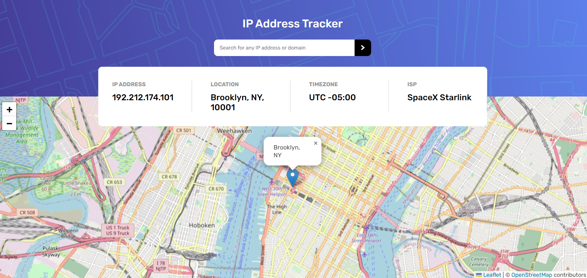

# IP Address Tracker

This is a solution to the [IP address tracker challenge on Frontend Mentor](https://www.frontendmentor.io/challenges/ip-address-tracker-I8-0yYAH0).

## Table of contents

- [Overview](#overview)
  - [The challenge](#the-challenge)
  - [Screenshot](#screenshot)
  - [Links](#links)
- [My process](#my-process)
  - [Built with](#built-with)
- [Author](#author)

## Overview

### The challenge

Users should be able to:

- View the optimal layout for each page depending on their device's screen size
- See hover states for all interactive elements on the page
- Search for any IP addresses or domains and see the key information and location

### Screenshot

### Links

- Solution URL: [https://github.com/arifaisal123/frontend_projects/tree/main/frontend_challenges/ip_address_tracker](https://github.com/arifaisal123/frontend_projects/tree/main/frontend_challenges/ip_address_tracker)
- Live Site URL: [https://iptrac.netlify.app/](https://iptrac.netlify.app/)

## My process

### Built with

- Semantic HTML5 markup
- CSS custom properties
- Flexbox
- LeafletJS
- GEO IP API (ipify)

## Author

- Website - [Arif Faisal](https://arifaisal123.github.io)
- Frontend Mentor - [@arifaisal123](https://www.frontendmentor.io/profile/arifaisal123)
- Twitter - [@faisalcodes123](https://www.twitter.com/faisalcodes123)
